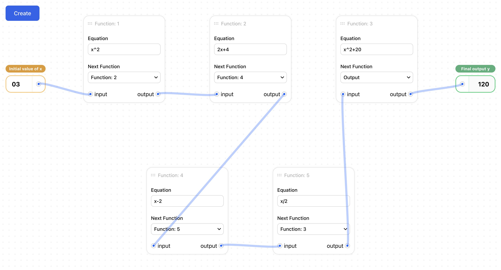

# Function Chain Calculator

A web application that enables users to create and execute a chain of mathematical functions, where the output of each function serves as the input for the next function in the sequence.



## 🌟 Features

- Chain of 5 interconnected mathematical functions
- Real-time calculation updates
- Visual representation of function connections
- Expression validation for mathematical operations
- Fixed execution order (1 → 2 → 4 → 5 → 3)

## 🚀 Getting Started

### Prerequisites

- Node.js (v16.0.0 or higher)
- npm (v7.0.0 or higher)

### Installation

1. Clone the repository:

```bash
git clone https://github.com/MrMischievousX/chain-calculation
cd chain-calculation
```

2. Install dependencies:

```bash
yarn
```

3. Start the development server:

```bash
yarn dev
```

The application will be available at `http://localhost:3000`

## 🏗️ Project Structure

```
src/
├── assets/
│   ├── pngs/
│   ├── readme/
│   └── svg/
├── components/
│   ├── ConnectDot.tsx
│   └── FunctionCard.tsx
├── hooks/
│   └── useDebounce.ts
├── types/
│    └── index.ts
├── utils/
│   └── index.ts
├── App.tsx
├── index.css
├── index.tsx
└── tailwind.config.js
```

### State Management

```typescript
interface FunctionNode {
  id: number;
  expression: string;
  nextId: number | null;
  position: { x: number; y: number };
}

interface AppState {
  initialValue: number;
  functions: FunctionNode[];
  finalOutput: number;
}
```

## 🛠️ Technologies Used

- React 18
- TypeScript
- Tailwind CSS
